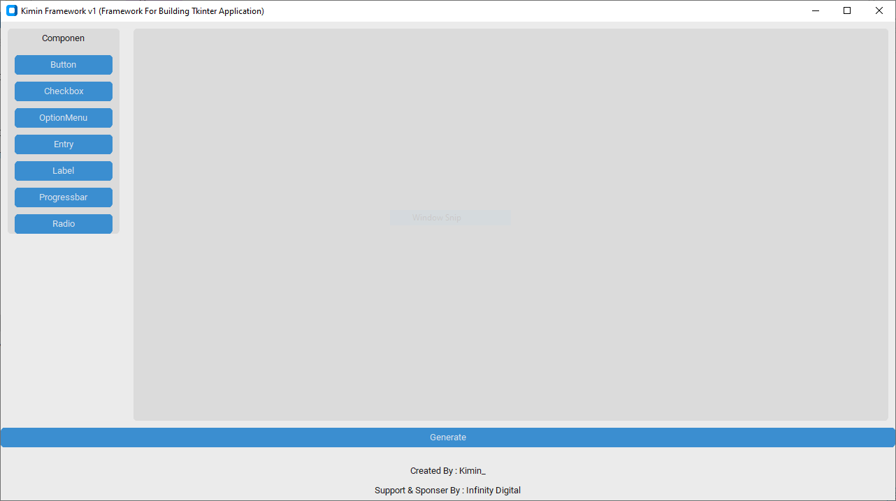
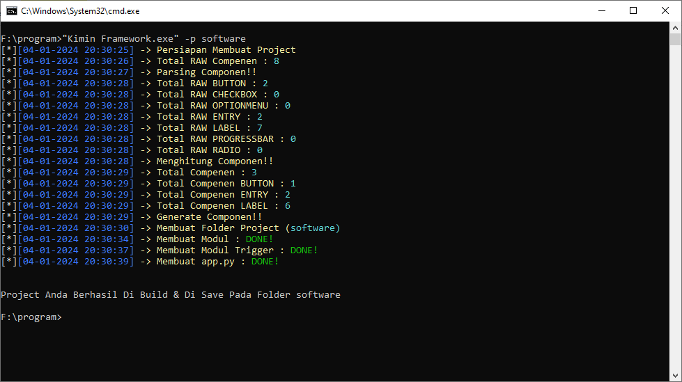
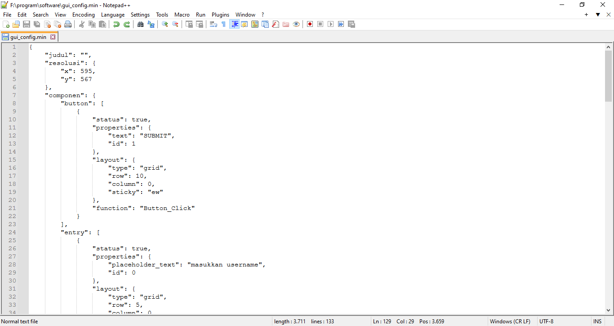
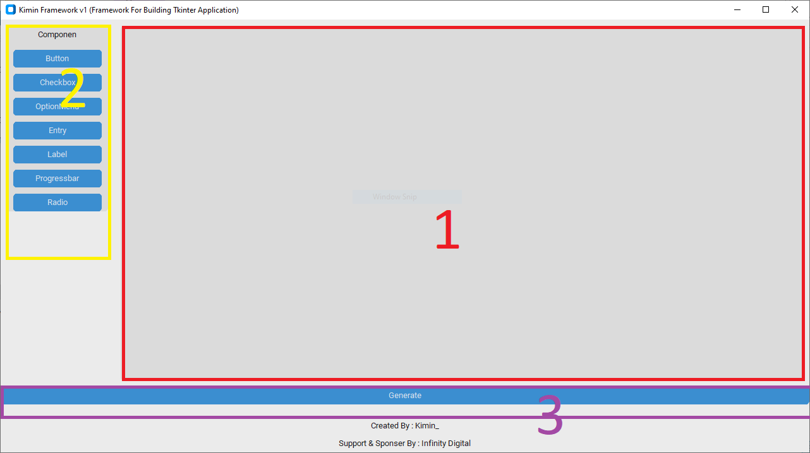

# Kimin Tkinter Framework

Kimin Tkinter Framework adalah sebuah framework inovatif yang dirancang khusus untuk mempermudah pengembangan aplikasi GUI Python berbasis Tkinter. Dengan fokus pada kemudahan penggunaan, framework ini memungkinkan pengembang untuk membuat antarmuka pengguna yang menarik dengan cepat dan efisien.

# List Dokumen

- [Introduction](#Introduction)
- [Fitur](#Fitur)
- [Version](#)
- [Usage](#Usage)
- [Componen Proprerties](#)

## Introduction

#### Overview
<p style="display: flex; justify-content: space-between;">
    
    
    
</p>

#### Deskripsi
<p style="display: flex; justify-content: space-between;">
    
</p>

Terdapat 3 aspek utama dalam Framework ini, Yang meliputi :

- [Working Area](#Working-Area)
- [Componen Area](#Componen-Area)
- [Generate Button](#Generate-Button)

###### Working Area
Working Area ditandai dengan nomor 1 pada gambar. Disinilah nanti layout yang akan digenerate pada aplikasi GUI dan tempat setiap komponen akan di tempatkan.

###### Componen Area
Componen Area ditandai dengan nomor 2 pada gambar. Disini componen yang akan ditempatkan pada working area ketika componen di klik

###### Generate Button
Digunakan untuk mengenerate Aplikasi gui ketika di klik

## Fitur
- Konfigurasi Layout Berbasis JSON
- Konfigurasi Trigger / Event Handler Berbasis JSON
- Generate Main App
- Generate Default Trigger / Event Handler
- Otomatis Install Packages

## Usage
``` bash
    "Kimin Tkinter Framework v1.exe" -p nama_project
```

Note : nama_project adalah nama project / aplikasi yang akan dibuat
